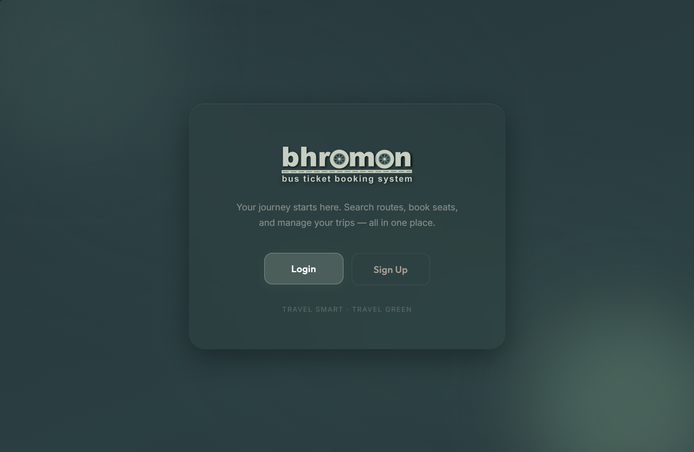

# 🚌 bhromon: Bus Ticket Booking System

 **Revolutionizing the way people travel!**\
 A full-stack bus ticket booking system built as a BUET database project, featuring PostgreSQL, REST APIs, authentication, booking management, and an admin dashboard.  



---

## 📑 Table of Contents

- [✨ Key Features](#-key-features)
- [🛠️ Tech Stack](#️-tech-stack)
- [🚀 Quick Start](#-quick-start)
- [💾 Database Setup](#-database-setup)
- [📁 Project Structure](#-project-structure)
- [👥 API Endpoints](#-api-endpoints)
- [📖 Course Info](#-course-info)
- [👨‍💻 Developers](#-developers)

---

## ✨ Key Features

- User registration and login
- JWT-based authentication
- Customer and admin roles
- Bus route and schedule management
- Real-time seat availability
- Seat reservation and booking
- Booking cancellation
- Payment workflow
- PostgreSQL transactions
- Database procedures and triggers
- Admin dashboard

---

## 🛠️ Tech Stack

- HTML5
- CSS3
- JavaScript
- Node.js
- Express.js
- PostgreSQL
- JWT
- bcrypt

## 🏗️ Architecture

```text
Frontend
   ↓
REST API
   ↓
Express.js Backend
   ↓
PostgreSQL Database
```

---

## 🚀 Quick Start

### Prerequisites
- Node.js v14+, PostgreSQL v12+, Git
- pgAdmin 4 or Navicat (database GUI tool)

### Setup
```bash
# 1. Clone & navigate
git clone https://github.com/MisbahUddinRafi/bhromon-bus-ticket-booking-system.git
cd bhromon-bus-ticket-booking-system

# 2. Install dependencies
npm install && cd backend && npm install

# 3. Create backend/.env
DB_USER=postgres
DB_PASSWORD=your_password
DB_HOST=localhost
DB_PORT=5432
DB_NAME=bhromon_db
PORT=3000
JWT_SECRET=your_secret_key

# 4. Setup database (see Database Setup section)

# 5. Run backend
node src/app.js

# 6. Open frontend
# Open frontend/index.html in browser
```


---

## 💾 Database Setup

**Use pgAdmin 4 (Free) or Navicat - NO Terminal Commands**

### Steps
1. **Create Database**: `bhromon_db` in your GUI tool
2. **Run SQL files in order**:
   - `database/schema/create_tables.sql`
   - `database/procedures/booking_functions.sql`
   - `database/triggers/` (all 4 files)
   - `database/seed/` (all 5 files)
3. **Verify**: Check tables exist using query tool

| Issue | Fix |
|-------|-----|
| Connection refused | Start PostgreSQL server |
| Auth failed | Verify password in `.env` |
| Foreign key error | Run SQL files in correct order |


---

## 📁 Project Structure

```
bhromon/
├── backend/
│   ├── src/
│   ├── controllers/
│   ├── routes/
│   └── middleware/
│
├── frontend/
│   ├── pages/
│   ├── js/
│   └── css/
│
├── database/
│   ├── schema/
│   ├── procedures/
│   ├── triggers/
│   └── seed/
│
└── docs/
```


---

## 👥 API Endpoints

| Category | Endpoints |
|----------|-----------|
| **Auth** | POST `/auth/register`, `/auth/login`, GET `/auth/verify` |
| **Customer** | GET `/customer/schedules`, `/schedule-details/:id`, `/schedule-seats/:id` |
| | POST `/customer/booking/hold`, `/booking/confirm` |
| **Admin** | POST `/admin/buses/add`, `/schedules/create`, `/routes/create` |
| **Booking** | GET `/booking/user-bookings`, POST `/booking/payment`, PUT `/booking/cancel/:id` |
| **Profile** | GET `/profile/user-info`, PUT `/profile/update` |


---

## 📖 Course Information

📚 **CSE 216** (Database Sessional) - BUET Term Project  
👨‍🏫 **Supervisor**: [Niaz Rahman](https://cse.buet.ac.bd/faculty/faculty_detail/niaz) (Lecturer, CSE, BUET)

Demonstrates: ER modeling, SQL, transactions, procedures, triggers, secure APIs

---

## 👨‍💻 Developers

| Name | ID | Contact |
|------|-----|---------|
| Md. Misbah Uddin Rafi | 2305069 | [GitHub](https://github.com/MisbahUddinRafi) |
| Md Rakibul Hasan Sumon | 2305072 | [GitHub](https://github.com) |

---

<div align="center">

**Made with ❤️ by CSE L2T1 Students • BUET • 2026**

</div>


